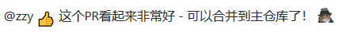

# Markdown语法和实例

本章节语法和实例包括Markdown基础语法和实例，以及GitHub风格Markdown（GitHub Flavored Markdown，简称`GFM`）的语法扩展和特性实例。

GitHub风格Markdown（GitHub Flavored Markdown，简称`GFM`）是GitHub官方为了在GitHub.com上更容易地进行文本内容格式化展示，而提供的一组Markdown语法扩展及特性支持。

> 💥 目前，GitHub风格Markdown（GitHub Flavored Markdown，简称`GFM`）已经成为Markdown的通用标准，兼容于各种Markdown工具链和各类Markdown展示支持网站。

GFM对于Markdown的语法和特性有些为语法扩展，有些为新增特性。已经成为通用标准，各类Markdown工具链和展示网站兼容支持很完善，因此合并介绍。

- [标题（Headers）](#标题headers)
- [字体（Emphasis）](#字体emphasis)
- [列表（Lists）](#列表lists)
- [图像（Images）](#图像images)
- [链接（Links）](#链接links)
- [锚点（Anchors）](#锚点anchors)
- [引用（Blockquotes）](#引用blockquotes)
- [代码（Code）](#代码code)
- [注释（Comment）](#注释comment)
- [表格（Tables）](#表格tables)

*主要应用于GitHub的Markdown扩展——*

- [SHA引用](#SHA引用)
- [Issue引用](#issue引用)
- [用户通知（@mentions）](#用户通知mentions)
- [表情符号（Emoji）](#表情符号emoji)

------

## 标题（Headers）

Markdown中共有6级标题，从 `#`、`##`、依次类推到 `######`。

### 1. 实例代码

``` Markdown
# 一级标题
## 二级级标题
### 三级标题
#### 四级级标题
##### 五级标题
###### 六级标题
```

### 2. 呈现效果

<div style="border:1px solid;margin:0px;padding:0px 0px 0px 15px">

# 一级标题

## 二级级标题

### 三级标题

#### 四级级标题

##### 五级标题

###### 六级标题

</div>

## 字体（Emphasis）

- *斜体*：用 `*` 或者 `_` 包裹文本进行 _斜体_ 格式化。
- **粗体**：用 `**` 或者 `__` 包裹文本进行 **粗体** 格式化。
- <del>删除线</del>：用`~~`包裹文本进行<del>删除线</del>格式化，部分工具和网站不支持展示。

`**` 或者 `__`、`*` 或者 `_`，以及`~~` 可以 <del>**_组合使用_**</del>。

### 1. 实例代码

``` Markdown
*这行文本是斜体*

_这行文本是斜体_

**这行文本是粗体**

__这行文本是粗体__

_这行文本是 **粗体** + 斜体_

~~_这行文本是 **粗体** + 斜体_ + 删除线~~
```

### 2. 呈现效果

<div style="border:1px solid;margin:0px;padding:0px 0px 0px 15px">

*这行文本是斜体*

_这行文本是斜体_

**这行文本是粗体**

__这行文本是粗体__

_这行文本是 **粗体** + 斜体_

<del>_这行文本是 **粗体** + 斜体_ + 删除线</del>

</div>

## 列表（Lists）

列表分为`无序列表`、`有序列表`，以及`任务列表`。

### 无序列表

无序列表用`-`定义，**下级列表相对于上级 `缩进空格 >= 2`**

#### 1. 实例代码

``` Markdown
- 第一节
- 第二节
  - 第一条（缩进空格2个）
  - 第二条
```

#### 2. 呈现效果

<div style="border:1px solid;margin:0px;padding:0px 0px 0px 15px">

- 第一节
- 第二节
  - 第一条（缩进空格2个）
  - 第二条

</div>

### 有序列表

有序列表`数字.`定义，**下级列表相对于上级 `缩进空格 > 2`**

#### 1. 实例代码

``` Markdown
1. 第一节
1. 第二节
1. 第三节
   1. 第一条（缩进空格3个）
   1. 第二条
```

#### 2. 呈现效果

<div style="border:1px solid;margin:0px;padding:0px 0px 0px 15px">

1. 第一节
1. 第二节
1. 第三节
   1. 第一条（缩进空格3个）
   1. 第二条

</div>

### 任务列表

`任务列表`是一个任务进度指示器，也可使用与拉取请求。

*注*：`任务列表`仅在部分Markdown工具软件或者网站支持展示，如GitHub；不是全部，使用前需要验证是否被支持。

#### 1. 实例代码

``` Markdown
- [x] 表情符号、引用API，以及<del>标签</del>已被支持。
- [x] 语法分析已经完成。
- [x] 此项已完成。
- [ ] 此项未完成。
```

#### 2. 呈现效果

<div style="border:1px solid;margin:0px;padding:0px 0px 0px 15px">


</div>

## 图像（Images）

格式：`Format: `

### 1. 实例代码

``` Markdown

```

### 2. 呈现效果

<div style="border:1px solid;margin:0px;padding:0px 0px 0px 15px">


</div>

## 链接（Links）

Markdown中可对url链接自动识别，但有些Markdown工具不支持（GitHub支持自动识别）。

若需指定url链接文本，格式：`[文本](url)`。

### 1. 实例代码

``` Markdown
[Markdown指南](https://markdown.budshome.com)

https://markdown.budshome.com

markdown.budshome.com
```

### 2. 呈现效果

<div style="border:1px solid;margin:0px;padding:0px 0px 0px 15px">

[Markdown指南](https://markdown.budshome.com)

[https://markdown.budshome.com](https://markdown.budshome.com)

[markdown.budshome.com](https://markdown.budshome.com)

</div>

## 锚点（Anchors）

格式：`[锚点文本](#锚点链接)`。需要注意如下几点：

- 欲定位的锚点链接必须是标题，即`#`、`###`等定义的6级标题；
- 不管标题大小写，锚点均为小写；
- 可以使用中文做锚点，中文锚点需要省略`（`、`、`等中文标点符号。

### 1. 实例代码

``` Markdown
标题：## 锚点（Anchors）
锚点：[锚点（Anchors）](#锚点anchors)
```

### 2. 呈现效果

<div style="border:1px solid;margin:0px;padding:0px 0px 0px 15px">

[锚点（Anchors）](#锚点anchors)

</div>

## 引用（Blockquotes）

Markdown中通过`>`实现引用。引用可以多级嵌套：`>>`,`>>>`；也可以和其它Markdown语法嵌套，比如无序列表。

### 1. 实例代码

``` Markdown
> 一级文本引用
>> 二级文本引用

引用中嵌套无序列表

>> * 这是第一项
>> * 这是第二项
```

### 2. 呈现效果

<div style="border:1px solid;margin:0px;padding:0px 0px 0px 15px">

不同工具和输出呈现效果有差别，如下两种——

**Markdown预览呈现**


**输出HTML呈现**

> 一级文本引用
>> 二级文本引用

引用中嵌套无序列表

>> - 这是第一项
>> - 这是第二项

</div>

## 代码（Code）

Markdown中代码格式化可以通过三种方式：

- 行内式：通过一对 ` 包裹单行代码实现；
- 代码块：通过一对 ``` 包裹实现，可以指定代码的编程语言，如`Python`、`JavaScript`、`Rust`等，且支持**语法高亮**；
- 缩进式：通过缩进 `>=` 4空格实现，部分支持语法高亮。

### 1. 实例代码

``` Markdown
行内式代码：`import os, sys`

代码块（无需缩进）：
    ``` Python
    import os, sys

    sys.path

    print(os)
    ```

缩进式：
    if (isAwesome){
      return true
    }
```

### 2. 呈现效果

<div style="border:1px solid;margin:0px;padding:0px 0px 0px 15px">

行内式代码：`import os, sys`

代码块（无需缩进）：

``` Python
import os, sys

sys.path

print(os)
```

缩进式：

    if (isAwesome){
        return true
    }

</div>

## 注释（Comment）

Markdown中注释可以通过二种方式实现：

- HTML注释：用`<!--...-->`标签来实现注释；
- HTML标签：用HTML标签显示属性`style='display: none'`标签来实现注释；
- HACK方法：用`Markdown解析原理`来实现注释。

_注：HACK方法基于`Markdown解析原理`，相较于`HTML注释`和`HTML标签显示属性`要稳定得多，但语义化差。_

> HACK方法注释写法很灵活，基于Markdown解析原理即可。以下实例代码仅试举几例，读者可自由组合。

### 1. 实例代码

``` Markdown
HTML注释 <!--...-->：

<!-- 我是单行注释，不会在浏览器中显示。-->

<!--
我是多行，
段落注释，
不会在浏览器中显示。
-->

HTML标签实现注释：

<div style='display: none'>
我是注释，
多行段落，
不会在浏览器中显示。
</div>

HACK方法注释（此处仅是举例，读者可以利用Markdown解析原理自由组合语法）：

[](我是注释，不会在浏览器中显示。)

[注释关键字]:(注释描述。)

[#]:<> (我是注释，不会在浏览器中显示。)
[#]:# (我是注释，不会在浏览器中显示。)
[注释]:<> (我是注释，不会在浏览器中显示。)
[注释]:# (我是注释，不会在浏览器中显示。)
[注释]:// (我是注释，不会在浏览器中显示。)
[//]:<> (我是注释，不会在浏览器中显示。)
[//]:# (我是注释，不会在浏览器中显示。)
```

### 2. 呈现效果

<div style="border:1px solid;margin:0px;padding:0px 0px 0px 15px">

HTML注释 <!--...-->：

<!-- 我是单行注释，不会在浏览器中显示。-->

<!--
我是多行，
段落注释，
不会在浏览器中显示。
-->

HTML标签实现注释：

<div style='display: none'>
我是注释，
多行段落，
不会在浏览器中显示。
</div>

HACK方法注释（此处仅是举例，读者可以利用Markdown解析原理自由组合语法）：

[](我是注释，不会在浏览器中显示。)

[注释关键字]:(注释描述。)

[#]:<> (我是注释，不会在浏览器中显示。)
[#]:# (我是注释，不会在浏览器中显示。)
[注释]:<> (我是注释，不会在浏览器中显示。)
[注释]:# (我是注释，不会在浏览器中显示。)
[注释]:// (我是注释，不会在浏览器中显示。)
[//]:<> (我是注释，不会在浏览器中显示。)
[//]:# (我是注释，不会在浏览器中显示。)

</div>

## 表格（Tables）

- 通过字符组合单元格，用管道分隔符 `|` 来分割单元格；无需上下对齐。
- 通过连字符 `-` 来声明表头，仅第一行底部需要。
- 通常情况下，表格默认**居中**。

### 1. 实例代码

``` Markdown
表头一 | 表头二 | 表头三
------- | ------ | ------
一行单元格一 | 一行单元格二 | 一行单元格三
二行内容一 | 二行内容二 | 二行内容三
三行描述部分一 | 三行描述部分二 | 三行描述部分三
```

### 2. 呈现效果

<div style="border:1px solid;margin:0px;padding:0px 0px 0px 15px">
<br />

表头一  | 表头二  | 表头三
------ | ------ | ------
一行单元格一 | 一行单元格二 | 一行单元格三
二行内容一 | 二行内容二 | 二行内容三
三行描述部分一 | 三行描述部分二 | 三行描述部分三

<br />
</div>

## 主要应用于GitHub的Markdown扩展

### SHA引用

GitHub仓库中，任何对提交（git commit）的SHA-1散列（哈希值）的引用都将自动转换为指向GitHub上提交的链接。

``` Markdown
16c999e8c71134401a78d4d46435517b2271d6ac
mojombo@16c999e8c71134401a78d4d46435517b2271d6ac
mojombo/github-flavored-markdown@16c999e8c71134401a78d4d46435517b2271d6ac
```

### Issue引用

在GitHub仓库中，任何涉及`Issue`或`拉请求`的数字都将自动转换为链接。

``` Markdown
#1
mojombo#1
mojombo/github-flavored-markdown#1
```

### 用户通知（@mentions）

在GitHub仓库的Issues中，`@`符号后输入用户名，就会通知此用户来查看评论。GitHub中称此为`@mention`。

不仅可以通知用户，还可以`@`通知*所在组织*中的团队。

### 表情符号（Emoji）

GitHub支持[表情符号](https://help.github.com/en/articles/basic-writing-and-formatting-syntax#using-emoji)，格式为：`:EMOJICODE:`。

``` Markdown
@zzy :+1: 这个PR看起来非常好 - 可以合并到主仓库了！ :shipit:
```

在GitHub中，会渲染为如下效果——



GitHub支持的表情符号很多，详细请查看[表情符号清单](https://github.com/ikatyang/emoji-cheat-sheet/blob/master/README.md)。

<br /><br /><br />

------
